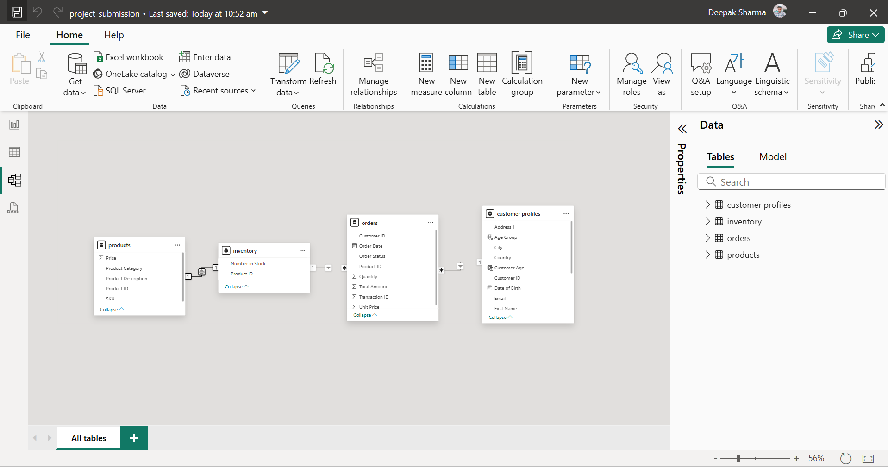
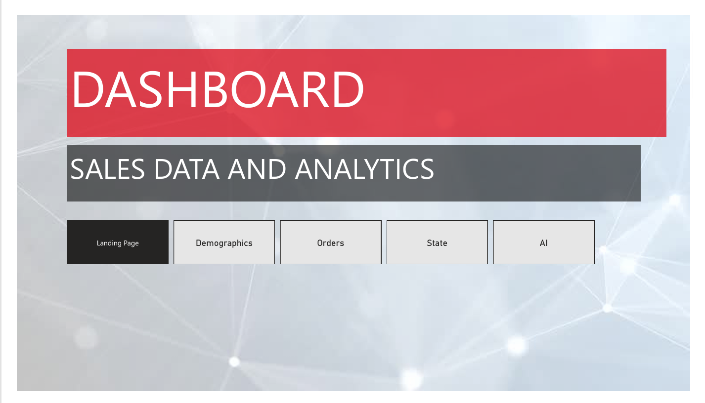
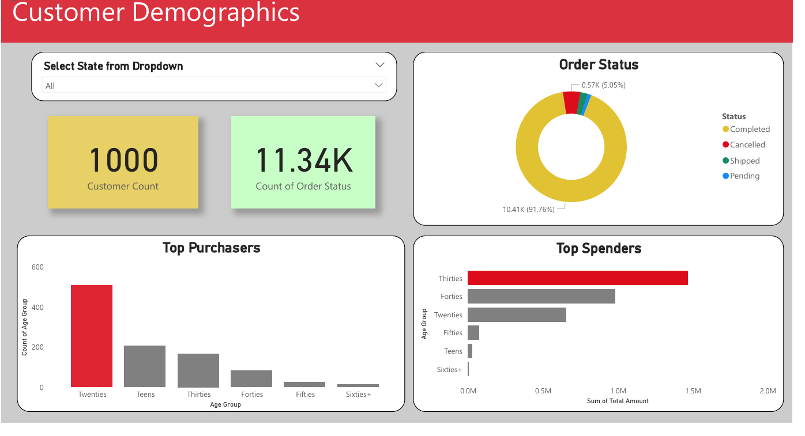
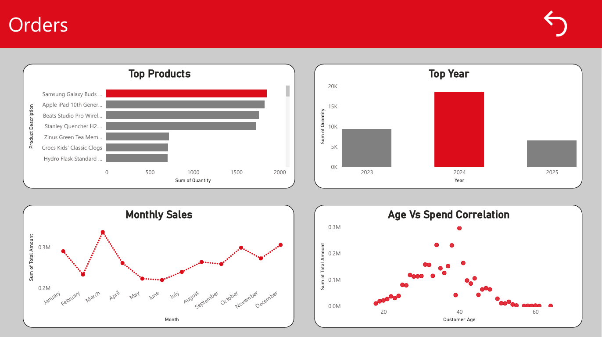
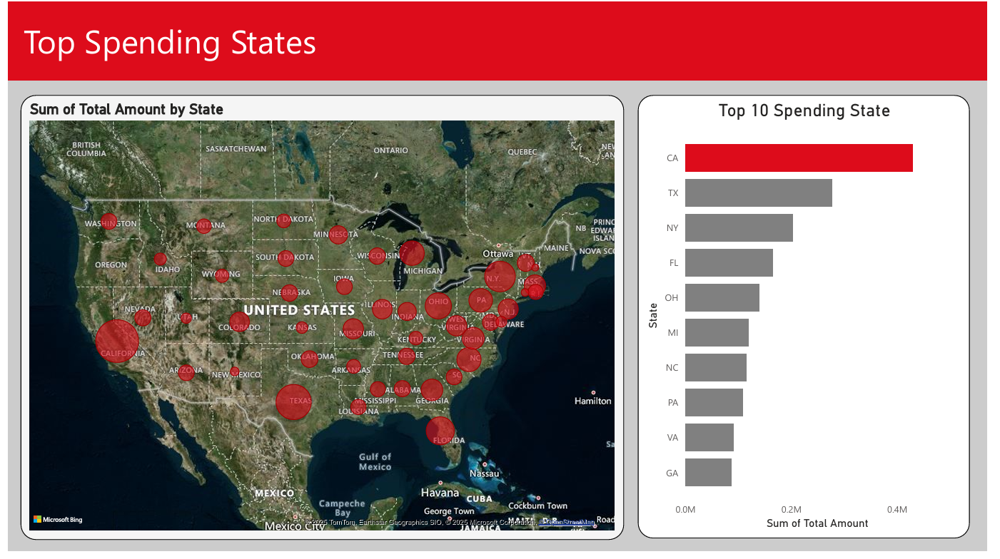

# 📊 Storytelling with Dashboards and Best Practices

This repository contains a Power BI dashboard project developed as part of the **Power BI Certification Nanodegree by Udacity**. The objective was to demonstrate **data storytelling** using **effective dashboards**, structured **data modeling**, and best practices for creating insights from business data.

---

## 📁 Project Overview

The dataset simulates a retail business scenario where we explore customer demographics, sales performance, and geographic distribution using rich, interactive visualizations. The report is designed with a clear **narrative flow**, leveraging Power BI features like **Power Query**, **DAX**, **drill-through**, **Q&A AI visual**, and **interactive filters**.

---

## 🧠 Skills Demonstrated

- 💡 Data Storytelling with dashboards
- 🧩 Star Schema data modeling
- 🛠️ Data transformation using Power Query
- 📐 Calculated columns and measures using DAX
- 🧭 Drill-through and navigation between report pages
- 📍 Geospatial analysis using map visuals
- 🤖 AI integration with Q&A visual

---

## 🗂️ Data Model

The data model follows a **Star Schema** with the following structure:

- **Fact Table**:  
  - `orders`: Includes order quantity, total amount, product and customer references.

- **Dimension Tables**:  
  - `products`: Product metadata including SKU, category, and price.  
  - `inventory`: Stock availability by product.  
  - `customer profiles`: Customer age, demographics, and location details.

---

## 📄 Report Pages & Features

### 1️⃣ Landing Page
- Serves as a central hub for navigation to all other report pages.
- Button-based navigation for intuitive storytelling.

---

### 2️⃣ Demographics Page
- **Top Spenders**: Bar chart displaying highest spending age groups.
- **Top Purchasers by Age Group**: Bar chart segmented by age.
- **Dropdown Filter**: Select state to filter visual elements.
- **Cards**: Customer Count & Order Count KPIs.
- **Donut Chart**: Order Status distribution.
- **Drill-through**: Navigate from age group to detailed Orders page.

---

### 3️⃣ Orders Page
- **Top Selling Year**: Bar chart by sales quantity.
- **Top Products**: Bar chart of most ordered items.
- **Monthly Sales Trend**: Line chart for seasonal performance.
- **Scatter Plot**: Age vs Spend correlation.
- **Reset Button**: Clears filters to default state.
- **Drill-through**: Access from Demographic page.

---

### 4️⃣ State Page
- **Map**: Bubble chart showing top spending states.
- **Bar Chart**: Top 10 states by total spend.

---

### 5️⃣ AI Page
- Demonstrates **Power BI Q&A Visual**.
- Allows users to type questions and get charts automatically.
- Examples include:
  - “Top 10 products by unit price”
  - “Top states by customer count”
  - “Order status by number of customers”

---

## ⚙️ ETL Workflow

**1. Power Query**
- Cleaned, transformed, and shaped data.
- Converted data types and handled nulls.
- Merged and filtered source tables.

**2. DAX**
- Created calculated columns for aggregations.
- Defined reusable measures for KPIs and charts.
- Enabled drill-through and dynamic visuals.

---

## 📌 How to Use

1. Clone this repository.
2. Open the `project_submission.pbix` file in **Power BI Desktop**.
3. Navigate using the Landing Page to explore insights.
4. Use filters and dropdowns to interact with data.

---

## 📦 Project Files

- `project_submission.pbix` – Power BI dashboard file.
- `data_model.png` – Data model diagram.
- `project_submission.pdf` – Report page screenshots (for reference).
- `README.md` – Project documentation.

---

## 📚 Learning Outcomes

✅ Understand importance of storytelling in dashboard design  
✅ Apply Power BI best practices (naming, schema, performance)  
✅ Integrate AI Q&A tools for natural language insights  
✅ Deliver insights from complex datasets with clarity and impact  

---

## 👨‍💻 Author

**Deepak Sharma**  
Udacity Certified Power BI Developer and Mentor  
📫 [LinkedIn](https://www.linkedin.com/in/deepak-sharma-58786aa0/) | 🌐 [Portfolio](https://github.com/deepaksharma1992)

